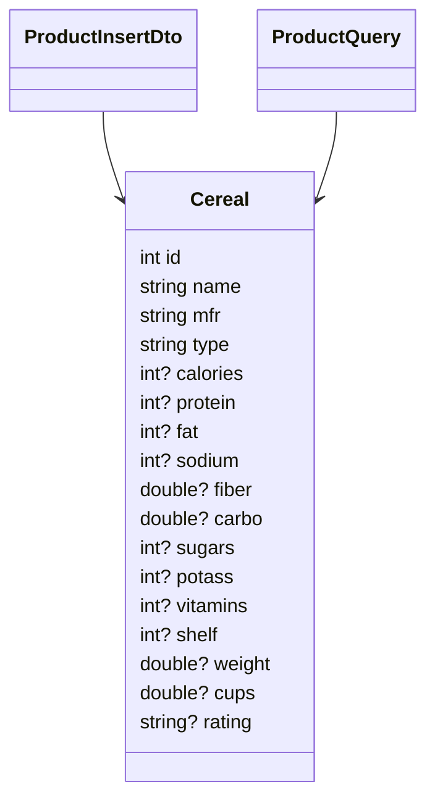

# Cereal API – README

> **Formål:** Et minimalt REST API til håndtering af morgenmads‑produkter (“cereals”) i SQL Server.  
> Opgaven demonstrerer import af CSV → database, CRUD-endpoints, filtrering, Dapper-baseret dataadgang og simple drifts‑endpoints.

---

## Indholdsfortegnelse
1. [Teknologier & Arkitektur](#teknologier--arkitektur)
2. [Kørsel lokalt](#kørsel-lokalt)
3. [Database & Skema](#database--skema)
4. [Dataimport (CSV → DB)](#dataimport-csv--db)
5. [API-dokumentation](#api-dokumentation)
   - [/auth](#auth)
   - [/cereals](#cereals--crud-med-kompositnøgle)
   - [/products](#products--filtrering--id-baseret-crud)
   - [/ops](#ops--drift)
   - [/weatherforecast](#weatherforecast-demo)
6. [Svarmodeller](#svarmodeller)
7. [Designbeskrivelse & Begrundelser](#designbeskrivelse--begrundelser)
8. [Sikkerhed & Rettigheder](#sikkerhed--rettigheder)
9. [Fejlhåndtering & Konventioner](#fejlhåndtering--konventioner)
10. [Diagrammer](#diagrammer)
11. [Appendiks: SQL scripts & migration](#appendiks-sql-scripts--migration)

---

## Teknologier & Arkitektur

- **.NET 9 Minimal APIs** (`Program.cs`, endpoint‑moduler i `src/Endpoints/*`)
- **Dapper** som “micro‑ORM” til letvægts dataadgang (parametriserede SQL‑kald)
- **SQL Server** (lokal eller container) – tabellen `dbo.Cereal`
- **Bulk import** med `SqlBulkCopy` (hurtig CSV → DB)
- **Struktur**
  - `src/Domain/Models/*` – POCO‑modeller og DTO’er
  - `src/Endpoints/*` – endpoints organiseret efter område (Authentication, CRUD, Ops, Products)
  - `src/Utils/*` – hjælpeklasser (CSV‑parser, HTTP/URL‑hjælpere)
  - `src/Data/*` – SQL‑connection factory


```text
Cereal API/
├─ Program.cs
├─ appsettings*.json
└─ src/
   ├─ Data/
   │  ├─ SqlConnection.cs
   │  └─ Cereal.csv
   ├─ Domain/Models/
   │  ├─ Cereal.cs
   │  ├─ ProductInsertDto.cs
   │  └─ ProductQuery.cs
   ├─ Endpoints/
   │  ├─ Authentication/AuthenticationEndpoints.cs
   │  ├─ CRUD/CRUDEndpoints.cs
   │  ├─ Ops/OpsEndpoints.cs
   │  └─ Product/ProductEndpoints.cs
   └─ Utils/
      ├─ CsvParser.cs
      └─ HttpHelpers.cs
SQL Statements/
├─ Create User.sql
└─ Create Table.sql
```

---

## Kørsel lokalt

### 1) Forudsætninger
- **.NET SDK 9**
- **SQL Server** (lokal, Docker eller Azure SQL)
- **Connection string** i `appsettings.json` (nøgle: `ConnectionStrings:Default`).  
  Eksempel (dev):  
  ```json
  "ConnectionStrings": {
    "Default": "Server=localhost,1433;Database=CerealDb;User Id=CerealApiCrudUser;Password=S3cure!Pass;Encrypt=false;TrustServerCertificate=true;MultipleActiveResultSets=true"
  }
  ```

### 2) Opret database + bruger
- Kør **`SQL Statements/Create User.sql`** i SSMS for at oprette:
  - Login + DB‑bruger `CerealApiCrudUser`
  - Databasen `CerealDb`
  - Tabellen `dbo.Cereal` (se [Database & Skema](#database--skema))
  - Tildel CRUD‑rettigheder til brugeren
- Alternativt kan du køre **`Create Table.sql`**, hvis DB allerede findes.

### 3) Start API’et
```bash
dotnet run --project "Cereal API/Cereal API.csproj"
# Default host (fra .http-filen): http://localhost:5024
```

---

## Database & Skema

Standardtabellen (fra scripts) er **uden** auto‑ID og bruger kompositnøgle som identitet:

```sql
CREATE TABLE dbo.Cereal (
  name     NVARCHAR(100) NOT NULL,
  mfr      NVARCHAR(10)  NOT NULL,  -- fabrikantkode: K,G,P,N,Q,R,...
  type     NVARCHAR(10)  NOT NULL,  -- 'C' (cold) / 'H' (hot) mv.
  calories INT NULL,
  protein  INT NULL,
  fat      INT NULL,
  sodium   INT NULL,
  fiber    FLOAT NULL,
  carbo    FLOAT NULL,
  sugars   INT NULL,
  potass   INT NULL,
  vitamins INT NULL,
  shelf    INT NULL,
  weight   FLOAT NULL,
  cups     FLOAT NULL,
  rating   NVARCHAR(100) NULL  -- bevidst STRING, se designnote
  -- PRIMARY KEY (name, mfr, type)  -- kompositnøgle
);
```

> **Bemærk:** Der findes også endpoints, der arbejder med `Id` (auto‑increment). Hvis du vil bruge disse, så se [Appendiks](#appendiks-sql-scripts--migration) for en enkel migration der tilføjer en `Id`‑kolonne og en unik constraint på `(name,mfr,type)`.

---

## Dataimport (CSV → DB)

**Endpoint:** `POST /ops/import-csv`  
**Indhold:** `multipart/form-data` med felt `file` (semikolon‑separeret CSV; 2. linje beskriver datatyper) – fx `src/Data/Cereal.csv` i repoet.  
**Implementering:** `SqlBulkCopy` med 1:1 kolonnemapping (hurtig import).  
**Svar:**
```json
{ "inserted": 77 }
```

Kommando‑eksempel (PowerShell 5.1 kompatibel):
```powershell
# 1) Find fuld sti (håndterer mellemrum)
$FilePath = Resolve-Path "Cereal API\src\Data\Cereal.csv"

# 2) Kald curl.exe (læg mærke til exe og de escaped citationstegn)
curl.exe --form "file=@`"$FilePath`";type=text/csv" http://localhost:5024/ops/import-csv
```

---

## API-dokumentation

### /auth

#### GET `/auth/health`
- **Formål:** Liveness‑probe / sundhedstjek.
- **Svar 200:** `{ "ok": true }`

---

### /cereals – CRUD (med kompositnøgle)

> Simpel CRUD direkte på tabellen, hvor **(name, mfr, type)** identificerer en række.  
> Velegnet når DB **ikke** har `Id`‑kolonne.

#### GET `/cereals`
Returnerer **alle** rækker (ordnet efter `name`).  
**200 OK** → `Cereal[]`

#### GET `/cereals/top/{take}`
Returnerer de første **N** rækker (navneorden).  
- `take` tvinges til `1 ≤ take ≤ 10000`.  
**200 OK** → `Cereal[]`

#### POST `/cereals`
Indsætter **ny** række. Body = `Cereal` (alle felter tilladt; `rating` er string).  
**200 OK** → `{ "inserted": 1 }`

#### PUT `/cereals/{name}/{mfr}/{type}`
Opdaterer eksisterende række **identificeret af stien** (navn, producentkode, type).  
Body = `Cereal` (de opdaterbare felter).  
- Specielle tegn i `name` **skal URL‑encodes** (fx `100% Bran` → `100%25%20Bran`).  
**200 OK** → `{ "updated": 1 }`  
**404 NotFound** → `{ "message": "Row not found." }`

#### DELETE `/cereals/{name}/{mfr}/{type}`
Sletter række efter kompositnøgle.  
**200 OK** → `{ "deleted": 1 }`  
**404 NotFound** → `{ "message": "Row not found." }`

---

### /products – Filtrering & ID‑baseret CRUD

> Udvidet endpoint‑sæt med **fri filtrering** via querystring samt **CRUD via `Id`**.  
> Kræver at tabellen har `Id`‑kolonnen – se [Appendiks](#appendiks-sql-scripts--migration).  
> Hvis `manufacturer` (fuldt navn) angives, mappes den automatisk til `mfr`‑kode.

#### GET `/products`
- Binder alle queryparametre til `ProductQuery` via `[AsParameters]`  
- Understøttede felter (uddrag):
  - **Id og strenge:** `id`, `name`, `nameLike` (case‑insensitive LIKE), `mfr` (kode), `manufacturer` (fuldt navn → map til kode), `type`, `rating`
  - **Tal:** `calories`, `protein`, `fat`, `sodium`, `fiber`, `carbo`, `sugars`, `potass`, `vitamins`, `shelf`, `weight`, `cups`
- Sortering: `ORDER BY name, Id`
- **200 OK** → `Cereal[]`

**Eksempler**
```
# nameLike=bran
curl.exe "http://localhost:5024/products?nameLike=bran"

# mfr=K & type=C & calories=70
curl.exe "http://localhost:5024/products?mfr=K&type=C&calories=70"

# manufacturer=Kellogg's & name=All-Bran  (apostrof URL-encodes til %27 for sikkerhed)
curl.exe "http://localhost:5024/products?manufacturer=Kellogg%27s&name=All-Bran"
```

#### GET `/products/{id}`
**200 OK** → `Cereal`  
**404 NotFound** → `{ "message": "Product not found." }`

#### DELETE `/products/{id}`
**200 OK** → `{ "deleted": 1 }`  
**404 NotFound** → `{ "message": "Product not found." }`

#### POST `/products`
**Body:** `ProductInsertDto`  
- **Create:** hvis `id` er `null` → indsæt og returnér `201 Created` med `Location: /products/{newId}`
- **Update:** hvis `id` er sat → opdater den eksisterende række
- **409 Conflict** hvis (name, mfr, type) allerede findes ved *Create*
- **400 BadRequest** hvis `id` er angivet, men ikke findes i DB

**Eksempel – Create**
```http
POST /products
Content-Type: application/json

{
  "name": "All-Bran",
  "mfr": "K",
  "type": "C",
  "calories": 70,
  "protein": 4,
  "fat": 1,
  "sodium": 260,
  "fiber": 9.0,
  "carbo": 7.0,
  "sugars": 5,
  "potass": 320,
  "vitamins": 25,
  "shelf": 3,
  "weight": 1.0,
  "cups": 0.33,
  "rating": "59.425.505"
}
```

**Eksempel – Update**
```http
POST /products
Content-Type: application/json

{
  "id": 123,
  "sugars": 6,
  "rating": "59.500.000"
}
```

---

### /ops – drift

#### POST `/ops/import-csv`
Importer semikolon‑CSV (felt `file`). Parser springer 2. linje (datatype‑linje) over.  
**200 OK** → `{ "inserted": <antal rækker> }`

---

### /weatherforecast (demo)

#### GET `/weatherforecast`
Demo‑endpoint fra `.NET template`. Returnerer 5 tilfældige rækker.  
**200 OK** → array med `{ date, temperatureC, temperatureF, summary }`

---

## Svarmodeller

### `Cereal`
```json
{
  "id": 123,            // Kun hvis DB er migreret med Id-kolonne
  "name": "All-Bran",
  "mfr": "K",
  "type": "C",
  "calories": 70,
  "protein": 4,
  "fat": 1,
  "sodium": 260,
  "fiber": 9.0,
  "carbo": 7.0,
  "sugars": 5,
  "potass": 320,
  "vitamins": 25,
  "shelf": 3,
  "weight": 1.0,
  "cups": 0.33,
  "rating": "59.425.505"   // string by design
}
```

### `ProductInsertDto`
Samme felter som `Cereal`, men `id` er valgfrit og bruges til at skelne **create** vs **update**.

---

## Designbeskrivelse & Begrundelser

- **Minimal APIs + modulopdeling pr. område**  
  Giver simple, eksplicitte endpoints og en meget lav abstraheringsoverhead. Filerne i `src/Endpoints/*` isolerer ansvar.
- **Dapper frem for tung ORM**  
  Vi skriver eksplicit SQL. Parametriserede queries ⇒ beskyttelse mod SQL‑injection.
- **`rating` som `string`**  
  Kildedata bruger lokaliserede talformater (f.eks. `68.402.973`). Lagring som `NVARCHAR` undgår afrundingsproblemer og kultur‑afhængige parsefejl.
- **To sæt endpoints**  
  - `/cereals`: kompatible med oprindeligt skema (uden `Id`), CRUD på **kompositnøglen**.  
  - `/products`: “RESTful” stil med **`Id`**, plus **fri filtrering** (bl.a. `nameLike`, `manufacturer`→`mfr`).
- **CSV‑import med `SqlBulkCopy`**  
  Hurtig og robust import (1:1 kolonnemapping), egnet til klassiske ETL‑scenarier.
- **Sikker URL‑opbygning** (`HttpHelpers`)  
  Hjælper med korrekt encoding af path‑segmenter (f.eks. `100% Bran`) og opbygning af querystrings.
- **Principper**  
  - Defensive parametre (fx cap på `/cereals/top/{take}`)  
  - Konsistente svarobjekter ved 404/409/400 (`{ message: "..." }`)  
  - Adskilt DB‑bruger med snævre rettigheder (kun CRUD på `dbo.Cereal`)

---

## Sikkerhed & Rettigheder

- Brugeren **`CerealApiCrudUser`** oprettes via scriptet med kun: `SELECT, INSERT, UPDATE, DELETE` på `dbo.Cereal`.  
- **Connection‑string** i dev sætter typisk `Encrypt=false;TrustServerCertificate=true` for at undgå certifikat‑besvær lokalt.  

---

## Fejlhåndtering & Konventioner

- **404 NotFound**: `{ "message": "Row not found." }` / `{ "message": "Product not found." }`
- **409 Conflict**: `{ "message": "A product with the same (name,mfr,type) already exists." }`
- **400 BadRequest**: ved ugyldige parametre ell. mismatch (fx POST /products med id som ikke findes)
- **Validation**: `/cereals/top/{take}` normaliserer værdien til `[1..10000]`

---

## Diagrammer

### Arkitektur (mermaid)

```mermaid
flowchart LR
  Client[Client / Swagger / curl] --> API[Minimal API (.NET 9)]
  API --> Endpoints[Endpoints (Authentication, CRUD, Products, Ops)]
  Endpoints --> Dapper[Dapper (parametriseret SQL)]
  Dapper --> SQL[(SQL Server - dbo.Cereal)]
  Ops -.-> Bulk[SqlBulkCopy CSV-import]
  CSV[(Cereal.csv)] --> Ops
```

### Domæne (forenklet klassediagram)



---

## Appendiks: SQL scripts & migration

### Hurtig start (uden Id)
Kør `SQL Statements/Create User.sql`. Det opretter DB, bruger, tabel **uden** `Id` og PK på `(name,mfr,type)` – fuldt kompatibelt med **/cereals**‑endpoints.

### Tilføj `Id` (for /products)
Hvis du vil bruge **/products**‑endpoints med `Id`, kan du migrere sådan her:

```sql
-- Tilføj kolonne + PK og unik constraint på (name,mfr,type)
ALTER TABLE dbo.Cereal ADD Id INT IDENTITY(1,1) NOT NULL;
ALTER TABLE dbo.Cereal ADD CONSTRAINT PK_Cereal_Id PRIMARY KEY (Id);
ALTER TABLE dbo.Cereal ADD CONSTRAINT UQ_Cereal_NameMfrType UNIQUE (name, mfr, type);
```

> **Bemærk:** Kør ovenstående én gang. Hvis du har eksisterende duplikater på (name,mfr,type), skal de ryddes først.

---

## Eksempler (curl)

```bash
# Health
curl http://localhost:5024/auth/health

# Alle cereals
curl http://localhost:5024/cereals

# Top-5
curl http://localhost:5024/cereals/top/5

# Update via kompositnøgle
curl -X PUT "http://localhost:5024/cereals/100%25%20Bran/N/C"   -H "Content-Type: application/json"   -d '{"sugars":6,"rating":"68.403.000"}'

# Filtrér produkter (kræver Id-kolonne i DB)
curl "http://localhost:5024/products?nameLike=bran&mfr=K&type=C"
```

---

## Licens
Se `LICENSE` i roden af repoet.