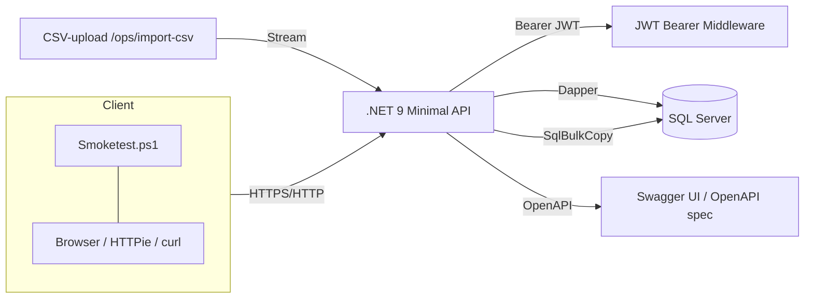

# Cereal API – README

Minimal .NET API til at importere, lagre og hente **morgenmadsprodukter (cereals)** fra SQL Server. Projektet bruger Dapper for letvægts dataadgang og inkluderer **Smoketest**-script, CSV-import endpoint og (ny) **Doxygen**-dokumentation.

> **Target Framework:** net9.0  
> **Kerneservices:** Dapper, Microsoft.Data.SqlClient  
> **Kørsel:** HTTP: `http://localhost:5024` • HTTPS: `https://localhost:7257`

---

## Funktioner
- CRUD/endpoints for produkter (cereals) og hjælpeendpoints (healthcheck).
- CSV-import endpoint til masseimport af `Cereal.csv`.
- **HTTPS**-understøttelse og forbedret warmup-logik til smoketest.
- **Dapper**-baseret dataadgang (ingen EF Core overhead).
- **Doxygen**-dokumentation af kode & kommentarer.


## Teknologier & Arkitektur

**Runtime & API**
- **.NET 9 Minimal APIs** (`Program.cs` + modulære endpoints i `src/Endpoints/*`)
- **Microsoft.AspNetCore.OpenApi 9.0.9** – indbygget OpenAPI/Swagger (typisk via `app.MapOpenApi(); app.UseSwaggerUI()`)

**Autentificering & Sikkerhed**
- **JWT Bearer**: `Microsoft.AspNetCore.Authentication.JwtBearer 9.0.9`
- **Token-håndtering**: `Microsoft.IdentityModel.Tokens 8.14.0`, `System.IdentityModel.Tokens.Jwt 8.14.0`
- **Password hashing**: `BCrypt.Net-Next 4.0.3`
- Typisk flow: `POST /auth/register` (hash med BCrypt) → `POST /auth/login` (verificér + udsted JWT) → beskyttede endpoints med `[Authorize]`/`RequireAuthorization` (Bearer)

**Dataadgang & Database**
- **Dapper 2.1.66** – mikro‑ORM for hurtige SQL queries/mapper til POCOs
- **SQL‑driver**: `Microsoft.Data.SqlClient 6.1.1`  (anbefalet)
- **Bulk import**: `SqlBulkCopy` (fra `Microsoft.Data.SqlClient`) til CSV → SQL Server

**Ops & Observability**
- **Smoketest.ps1** – end‑to‑end helbredstjek (inkl. HTTPS‑warmup af `/auth/health`)
- **Logging** – via ASP.NET Core logging (konfig i `appsettings*.json`)
- **Doxygen** – kildekode‑dokumentation fra kommentarer/docstrings

**Overblik (forenklet)**


**Pakkereferencer (uddrag)**
- `BCrypt.Net-Next 4.0.3`
- `Dapper 2.1.66`
- `Microsoft.AspNetCore.Authentication.JwtBearer 9.0.9`
- `Microsoft.AspNetCore.OpenApi 9.0.9`
- `Microsoft.Data.SqlClient 6.1.1`
- `Microsoft.IdentityModel.Tokens 8.14.0`
- `System.IdentityModel.Tokens.Jwt 8.14.0`

---


## Projektstruktur

```text
└─ Uge-4-Opgave-1-API-Cereal/
   ├─ docs/
   ├─ Cereal API/
   │  ├─ Properties/
   │  │  └─ launchSettings.json
   │  ├─ src/
   │  │  ├─ Cereal pictures/
   │  │  │  └─ Cereal Pictures/
   │  │  ├─ Data/
   │  │  │  ├─ Repository/
   │  │  │  │  └─ UserRepository.cs
   │  │  │  ├─ Cereal.csv
   │  │  │  └─ SqlConnection.cs
   │  │  ├─ Domain/
   │  │  │  ├─ Middleware/
   │  │  │  │  └─ RequestloggingMiddleware.cs
   │  │  │  └─ Models/
   │  │  │     ├─ Cereal.cs
   │  │  │     ├─ ProductInsertDto.cs
   │  │  │     ├─ ProductQuery.cs
   │  │  │     └─ User.cs
   │  │  ├─ Endpoints/
   │  │  │  ├─ Authentication/
   │  │  │  │  └─ AuthenticationEndpoints.cs
   │  │  │  ├─ CRUD/
   │  │  │  │  └─ CRUDEndpoints.cs
   │  │  │  ├─ Ops/
   │  │  │  │  └─ OpsEndpoints.cs
   │  │  │  └─ Product/
   │  │  │     └─ ProductEndpoints.cs
   │  │  ├─ Logs/
   │  │  ├─ Properties/
   │  │  │  └─ launchSettings.json
   │  │  └─ Utils/
   │  │     ├─ Security/
   │  │     │  ├─ Authz.cs
   │  │     │  ├─ JwtHelper.cs
   │  │     │  └─ PasswordHasher.cs
   │  │     ├─ CsvParser.cs
   │  │     ├─ FilterParser.cs
   │  │     ├─ HttpHelpers.cs
   │  │     └─ SortParser.cs
   │  ├─ appsettings.Development.json
   │  ├─ appsettings.json
   │  ├─ Cereal API.csproj
   │  ├─ Cereal API.http
   │  ├─ Program.cs
   │  ├─ Smoketest.ps1
   │  └─ Smoketest2.ps1
   ├─ SQL Statements/
   │  ├─ Create Table.sql
   │  ├─ Create User Table.sql
   │  ├─ Create User.sql
   │  └─ Extra Queries.sql
   ├─ .gitignore
   ├─ Cereal API.slnx
   ├─ LICENSE
   └─ README.md
```

---

## Kørsel lokalt

### 1) Forudsætninger
- **.NET SDK 9**
- **SQL Server** (lokal, Docker eller Azure SQL)
- **Connection string** i `appsettings.json` (nøgle: `ConnectionStrings:Default`).  
  Eksempel (dev):  
  ```json
  "ConnectionStrings": {
    "Default": "Server=localhost,1433;Database=CerealDb;User Id=CerealApiCrudUser;Password=S3cure!Pass;Encrypt=false;TrustServerCertificate=true;MultipleActiveResultSets=true"
  }
  ```

### 2) Opret database + bruger
- Kør **`SQL Statements/Create User.sql`** i SSMS for at oprette:
  - Login + DB‑bruger `CerealApiCrudUser`
  - Databasen `CerealDb`
  - Tabellen `dbo.Cereal` (se [Database](#database))
  - Tildel CRUD‑rettigheder til brugeren
- Alternativt kan du køre **`Create Table.sql`**, hvis DB allerede findes.

### 3) Start API’et
```bash
cd "Cereal API"
dotnet run --urls "https://localhost:7257;http://localhost:5024"
```
Applikationen starter på:
- HTTP: http://localhost:5024
- HTTPS: https://localhost:7257

---

### Database
Find SQL scripts under:
```
Uge-4-Opgave-1-API-Cereal/SQL Statements/Create Table.sql
Uge-4-Opgave-1-API-Cereal/SQL Statements/Create User Table.sql
Uge-4-Opgave-1-API-Cereal/SQL Statements/Create User.sql
Uge-4-Opgave-1-API-Cereal/SQL Statements/Extra Queries.sql
```

> Tabellen `dbo.Cereal` har bl.a.: `name, mfr, type, calories, protein, fat, sodium, fiber, carbo, sugars, potass, vitamins, shelf, weight, cups, rating`.

---

## Dataimport (CSV → DB)

**Endpoint:** `POST /ops/import-csv`  
**Indhold:** `multipart/form-data` med felt `file` (semikolon‑separeret CSV; 2. linje beskriver datatyper) – fx `src/Data/Cereal.csv` i repoet.  
**Implementering:** `SqlBulkCopy` med 1:1 kolonnemapping (hurtig import).  
**Svar:**
```json
{ "inserted": 77 }
```

Kommando‑eksempel (PowerShell 5.1 kompatibel):
```powershell
# Fra projektroden (tilpas sti og port)
curl.exe -F "file=@src/Data/Cereal.csv" https://localhost:7257/ops/import-csv --insecure
```

## Test

Script: `Smoketest.ps1`  
Kørsel (eksempel):
```powershell
# HTTPS (typisk udviklingsport 7257)
powershell -ExecutionPolicy Bypass -File .\"Cereal API"\Smoketest.ps1 -BaseUrl https://localhost:7257/

# HTTP (typisk 5024)
powershell -ExecutionPolicy Bypass -File .\"Cereal API"\Smoketest.ps1 -BaseUrl http://localhost:5024/
```

### Resultat af nyeste test
Test kan findes i src/Logs

De sidste 2 test jeg lavede inden opdatering af README.md filen:
```sql
25-10-03 09-26 Smoketest [PASS].log -- HTTP Test
25-10-03 09-29 Smoketest [PASS].log -- HTTPS Test
```
---

## API-dokumentation

## Endpoints

- **GET** `/_echo`  _(fil: AuthenticationEndpoints.cs)_
- **GET** `/health`  _(fil: AuthenticationEndpoints.cs)_
- **POST** `/login`  _(fil: AuthenticationEndpoints.cs)_
- **POST** `/logout`  _(fil: AuthenticationEndpoints.cs)_
- **GET** `/me`  _(fil: AuthenticationEndpoints.cs)_
- **POST** `/register`  _(fil: AuthenticationEndpoints.cs)_
- **GET** `/top/{take:int}`  _(fil: CRUDEndpoints.cs)_
- **DELETE** `/{name}/{mfr}/{type}`  _(fil: CRUDEndpoints.cs)_
- **PUT** `/{name}/{mfr}/{type}`  _(fil: CRUDEndpoints.cs)_
- **POST** `/ops/import-csv`  _(fil: OpsEndpoints.cs)_
- **DELETE** `/{id:int}`  _(fil: ProductEndpoints.cs)_
- **GET** `/{id:int}`  _(fil: ProductEndpoints.cs)_
- **GET** `liste/`  _(fil: ProductEndpoints.cs)_
- **GET** `/weatherforecast`  _(fil: Program.cs)_

> Se filerne i `src/Endpoints/*` for detaljer, validering og query-params.

---

## Dokumentation (Doxygen)

Doxygen-projekt (tilføjet i commits — opret `Doxyfile` ved behov).

```bash
# Kræver doxygen installeret
doxygen Doxyfile
# Output (typisk): docs/html/index.html
```

---

## Versionshistorik

### 2025-10-03
- Doxygen dokumentation oprettet.
- Ryddet op i projektet: fjernet ubrugt `Db.cs`; kommenteret SQL statements.
- Smoketest stabiliseret; opdaterede NuGet-packages; nye logfiler.
### 2025-10-02
- Delopgave 5 skabt (kræver test på arbejdsserver).
- Merge fra `main` og diverse smårettelser.
### 2025-10-01
- HTTPS understøttelse tilføjet og problemer med warmup i smoketest løst.
- Delopgave 3 + første smoketest; README opdatering.
### 2025-09-29
- Tilføjet produkt-endpoints og opdaterede smoketests.
- Opdateret README og SQL statements inkl. CSV-import fix.
- Etableret kode-struktur, tests og endpoints.
- Initiel SQL-connection og initial commit.

---

## Designbeskrivelse & Begrundelser

- **Minimal APIs + modulopdeling pr. område**  
  Giver simple, eksplicitte endpoints og en meget lav abstraheringsoverhead. Filerne i `src/Endpoints/*` isolerer ansvar.
- **Dapper frem for tung ORM**  
  Vi skriver eksplicit SQL. Parametriserede queries ⇒ beskyttelse mod SQL‑injection.
- **`rating` som `string`**  
  Kildedata bruger lokaliserede talformater (f.eks. `68.402.973`). Lagring som `NVARCHAR` undgår afrundingsproblemer og kultur‑afhængige parsefejl.
- **To sæt endpoints**  
  - `/cereals`: kompatible med oprindeligt skema (uden `Id`), CRUD på **kompositnøglen**.  
  - `/products`: “RESTful” stil med **`Id`**, plus **fri filtrering** (bl.a. `nameLike`, `manufacturer`→`mfr`).
- **CSV‑import med `SqlBulkCopy`**  
  Hurtig og robust import (1:1 kolonnemapping), egnet til klassiske ETL‑scenarier.
- **Sikker URL‑opbygning** (`HttpHelpers`)  
  Hjælper med korrekt encoding af path‑segmenter (f.eks. `100% Bran`) og opbygning af querystrings.
- **Principper**  
  - Defensive parametre (fx cap på `/cereals/top/{take}`)  
  - Konsistente svarobjekter ved 404/409/400 (`{ message: "..." }`)  
  - Adskilt DB‑bruger med snævre rettigheder (kun CRUD på `dbo.Cereal`)

---

## Sikkerhed & Rettigheder

- Brugeren **`CerealApiCrudUser`** oprettes via scriptet med kun: `SELECT, INSERT, UPDATE, DELETE` på `dbo.Cereal`.  
- **Connection‑string** i dev sætter typisk `Encrypt=false;TrustServerCertificate=true` for at undgå certifikat‑besvær lokalt.  

---

## Fejlhåndtering & Konventioner

- **404 NotFound**: `{ "message": "Row not found." }` / `{ "message": "Product not found." }`
- **409 Conflict**: `{ "message": "A product with the same (name,mfr,type) already exists." }`
- **400 BadRequest**: ved ugyldige parametre ell. mismatch (fx POST /products med id som ikke findes)
- **Validation**: `/cereals/top/{take}` normaliserer værdien til `[1..10000]`

---

## Eksempler (curl)

```bash
# Health
curl http://localhost:5024/auth/health

# Alle cereals
curl http://localhost:5024/cereals

# Top-5
curl http://localhost:5024/cereals/top/5

# Update via kompositnøgle
curl -X PUT "http://localhost:5024/cereals/100%25%20Bran/N/C"   -H "Content-Type: application/json"   -d '{"sugars":6,"rating":"68.403.000"}'

# Filtrér produkter (kræver Id-kolonne i DB)
curl "http://localhost:5024/products?nameLike=bran&mfr=K&type=C"
```

---

## Licens
Se `LICENSE` i roden af repoet.
